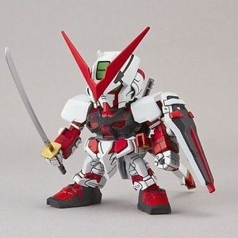

# CutMix

----------------
- Author: Sunguk Jung
- Link: https://arxiv.org/abs/1905.04899
- Tags: Regulization
- Thesis: CutMix has good performance in generalization of model and efficient preprocessing method.
- 리뷰여부: Yes

- Sangdoo Yun, Dongyoon Han, Seong Joon Oh, Sanghyuk Chun, Junsuk Choe, Youngjoon Yoo

--------
###absctract 
- Dropout은 cnn의 성능 향상을 시키는데 쓰인다. 이는 모델이 객체에 대해서 덜 차별적이게 도와주는 것인데 대표적으로 모델에서 이미지에 검은색 칸을 붙이거나 랜덤 노이즈를 발생시켜서 덧붙이는 방식으로 동작한다.
  그런데 이게 항상 좋은 것은 아닌 게 이미지의 정보 손실이기 때문에 쓰면 안될때가 있다. 그래서 우리는 컷믹스-어규멘테이션을 제안함이는 일정 비율의 패치를 트레인 이미지 사이에서 자르고 붙여서 어규멘테이션 시키는 거임 효율적인 트래인 픽셀의 사용과 지역적인 드랍아웃의 효과를 사용하여, 
  컷 믹스는 최신의 어규멘테이션을 수행하는거임 이걸 적용시키고 훈련시켰더니 모델이 더 강건해졌던 것을 확인 할 수 있었다.. 쉽게 구현 할수 있고, 계산적인 오버헤드도 없다. RESNET에서 제일 좋은 성능향상이 있었다.
  
------
###Introduction
- 아무 패널티 장치가 없이 학습 시킨다면 CNN이 인풋 이미지의 작은 부분에 너무 많이 중하는 경우가 있는데, 이런 경우 이전엔 드랍아웃으로 해결하려 했었다. 
  본 연구는 그렇게 삭제되는 부분은 어떻게보면 정보의 손실이기도 했기 때문에, 이 효율을 어떻게 극대화 할건지 고민을 많했고, 지역적인 드랍아웃을 사용해서 더 나은 일반화를 시킬수 있는지 고민했었다. 
  이는 단순히 픽셀을 제거는게 아니라 제거 부분의 픽셀에 대해서 다른 이미지로 채우는 것이다. 당연히 그에 따른 그라운드 트루스에 대한 레이블도 부분적으로 쎃이게된다. 컷믹스는 트래이닝 동안에 동일한 형태의 픽셀이 없는 속성을 가지고 있고, 
  이는 트래이닝을 더 효율적으로 만들뿐만아니라 지역적인 드랍아웃의 이점을 고수할 수 있고, 객체에 대해 차별적이지 않게된다. 추가된 패치는 모델에 대해서 지역적으로 보이는 부분들에 대한 오브젝트를 확인 할 수 있는 능력을 강화 시키고,
  훈련과 추론의 값은 동일하게 남는다.컷믹스는 믹스드 업하고 비슷한데, 두 이미지에서 가져온 두 가지의 샘플과 두 레이블을 쎃는 다는 점에서 비슷한 점을 가지고 있다. 반면, 인터폴레이션 기법을 적용시킨 믹스드업은 약간 부자연스러운 점이 있다.
  다음은 MixedUp의 그림예제이다.
  
  
  
  그러나 컷믹스는 이미지 구역 자체를 다른 트래이닝 이미지로 대체하는 식으로 해버린다. 다음 그림은 컷믹스이다.
  
  
-------------
###Related Works
  
- Regional dropout : 이미지의 지역적인 일부분을 제거하는 것을 수행함으로써, CNN의 generalization performance를 높이는 과정이다. 지역적인 부분을 제거한, 샘플 이미지들을 생성하는 방법이다. 
  컷믹스에선 지역적인 부분을 아예 덮어씌는 식으로 없애버리는 식으로 어찌되었건 기존의 정보들이 덮여서 소실되어버리는 단점이 있다.
  
- Mixup : 두 이미지의 샘플을 linear interpolation of one-hot labels에 의해 조합한다는 점에서 컷믹스는 Mixup이랑 비슷하다. Mixup의 샘플은 지역적으로 모호하고 부자연 스러운 요소를 지니고 있어서 모델에 혼란을 줄 수 있다는 단점이다

- Tricks for training deep networks: 컴퓨터 비전의 딥러닝 네트워크의 효과적인 학습을 위한 한 가지 가장 중요한 방법은 많은 데이터를 때려넣는 것이다. 
  이에 대해서 weight decay, dropout , Batch Normalization의 기술들이 사용되어지고 있고, 최근엔 CNN에 일부 노이즈를 넣어서 overfitting에 빠지지 않는 기술들이 제안되고 있다. 
  컷믹스는 이러한 효과들을 쉽게 만들 수 있는데, 그 이유가 바로 데이터 레벨에서만 건들고 네트워크의 구조를 건들거나 하지않기 때문에, 연산량이 적다.
  
-------
###CutMix 알고리즘
- 이미지 x가 W(넓이),H(높이),C(채널)로 주어졌다고 가정한다면, 컷믹스의 목표는 새로운 training sample을 두 가지의 샘플 그룹을 조합함으로써 생성하는 것이다. 이를 각각 (xA , yA ) 와 (xB , yB )로 두고 생성된 샘플은 (x ̃, y ̃)으로 표시한다고 가정하겠다. x ̃은 생성된 이미지, y ̃은 x ̃의 레이블을 의미한다. 이렇게 생성된 트레이닝 샘플 (x ̃, y ̃) 는 모델의 학습에 사용된다. 
  (x ̃, y ̃) 의 정의에 따라 조합하는 공식은 다음과같다.
  
  
- M은 binary Mask로 잘라낼 부분을 의미하고 이는 드랍아웃을 수행하는 것이라 볼 수 있다.
- ⊙ 는 아다마르 행렬 곱셈을 의미한다. Mixup과 유사하게 λ 비율을 두 개의 데이터에 샘플 시켜 조합하는데, 베타분포도가 사용된다 Beta(α, α) .
  여기서 α 는 1로 설정되고, λ 는 the uniform distribution (0, 1) 으로부터 하나가 뽑아지는 것이다. 여기까지는 MixedUp하고 동일하지만 CutMix는 λ의 비율만큼 샘플링된 이미지를 대체한다는 차이점이 있다. 이
  진 마스크를 만들고 바운드박스를 설정하기위한 방법은 다음과 같다.  바운더리 박스를B = (rx,ry,rw,rh)로 두고, 이는 indicating the cropping regions on xA and xB라면, A내부에 있는 지역B가 있다면, 이 A내부의 지역 B는 없어지고 다른이미지 B의 지역 B 부분으로 채워진다는 것이다.
  
  추가로 rx,ry는 랜덤하게 선택되고 rw,rh,역시 자를부분이 랜덤으로 선택되는것이다.
  
------
###Code 
- 지금까지 내용을 코드로 작성 해보고 그 입력과 결과를 확인 해보겠다.
  전체 파일과 코드는 <a href='https://github.com/Malgus1995/Today-i-Learned/tree/master/CutMix'>여기</a>를 참조하길 바란다.
     
  

    def CutMix(img1,img2):
    img_width=img1.shape[1]
    img_height=img1.shape[0]
    while(1):
    ratio = np.round(np.random.uniform(),2)
    absolute_rwv = np.int(img_width*np.sqrt(1-ratio))
    absolute_rhv = np.int(img_height*np.sqrt(1-ratio))

        sample1_binary_filter_base = np.ones((img_height,img_width))
        sample2_binary_filter_base = np.zeros((img_height,img_width))
        
            
        point_x = np.int(np.random.uniform(0,img_width))
        if point_x+absolute_rwv>img_width:
            continue
    
        point_y = np.int(np.random.uniform(0,img_height))
        if point_y+absolute_rhv>img_height:
            continue
        break
    
    #print(point_x,",",point_y)
    
    sample1_binary_filter_base[point_y:point_y+absolute_rhv,
                               point_x:point_x+absolute_rwv] =np.zeros((absolute_rhv,absolute_rwv))
    
    sample2_binary_filter_base[point_y:point_y+absolute_rhv,
                               point_x:point_x+absolute_rwv] =np.ones((absolute_rhv,absolute_rwv))
    

    processed_sample1 = np.zeros((img_width,img_height,3))
    roi_processed_sample2 = np.zeros((img_width,img_height,3))
    for ch in range(0,img_channel):
        processed_sample1[:,:,ch] = sample1_binary_filter_base*img1[:,:,ch]
        roi_processed_sample2[:,:,ch] =sample2_binary_filter_base*img2[:,:,ch]
    
    mixed_img =processed_sample1+roi_processed_sample2
    
    return mixed_img,ratio 

- 샘플이미지로
  
  
  
  
  이 두가지를 넣게 되었을 때 진행 결과는 다음과 같다.
  
  
  
- 이는 바로 uniform distribution으로 일정 확률의 λ를 구한 다음에 이 크기만큼 짤라내서 붙인것이다. 레이블은 당연히
이 새롭게 생성된 이미지에서 더 크기가 큰 부피를 차지하는 녀석으로 된다. 그렇다면, 이렇게 단편적인 알고리즘을 확인했으니 직접 모델에 넣어서
  전처리 시켜보고 모델을 학습 시켜보자.
  
---------
###Application
Walk and run의 데이터 셋에 대해 적용 시켜서 어규멘테이션을 취했다. 
자세한 것은 노트북 커널을 확인 바란다.
https://www.kaggle.com/jcruxsu/walk-and-run-with-simple-convnet-with-cutmix
  
