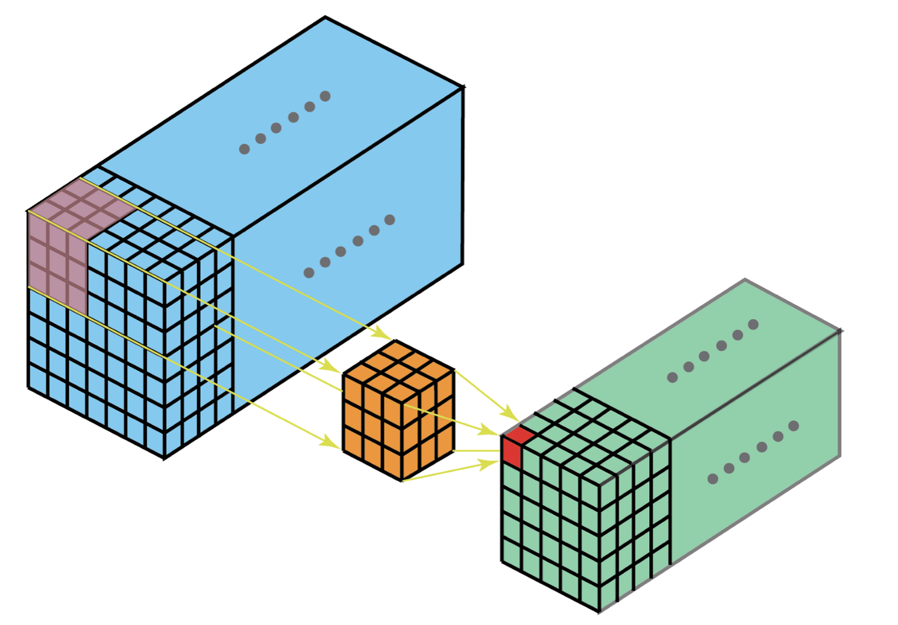
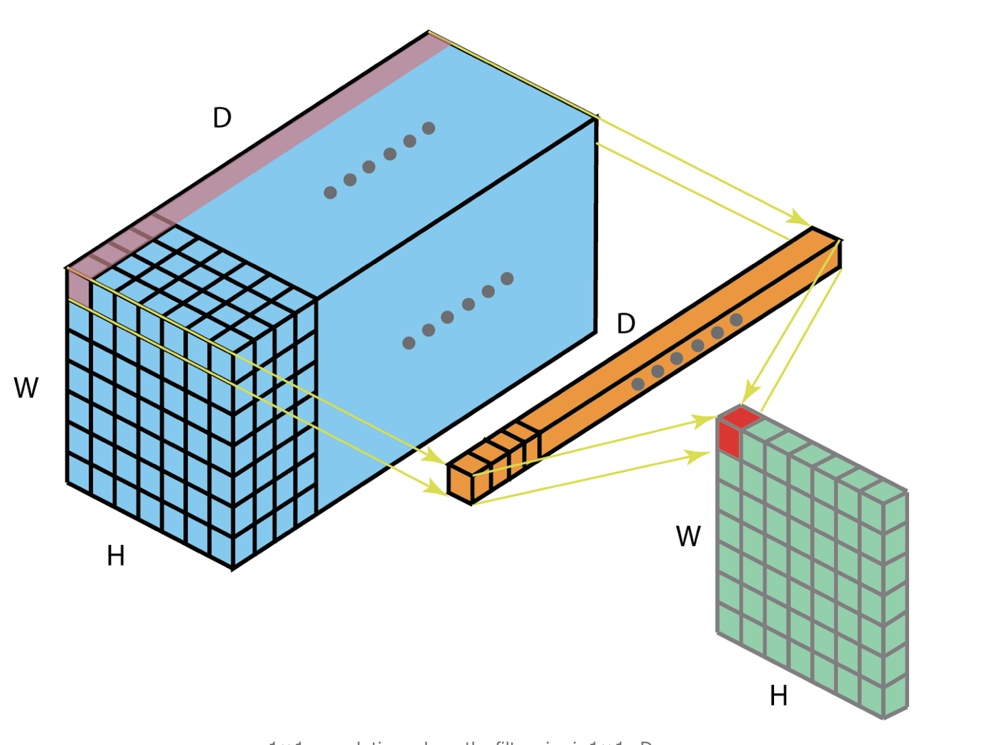
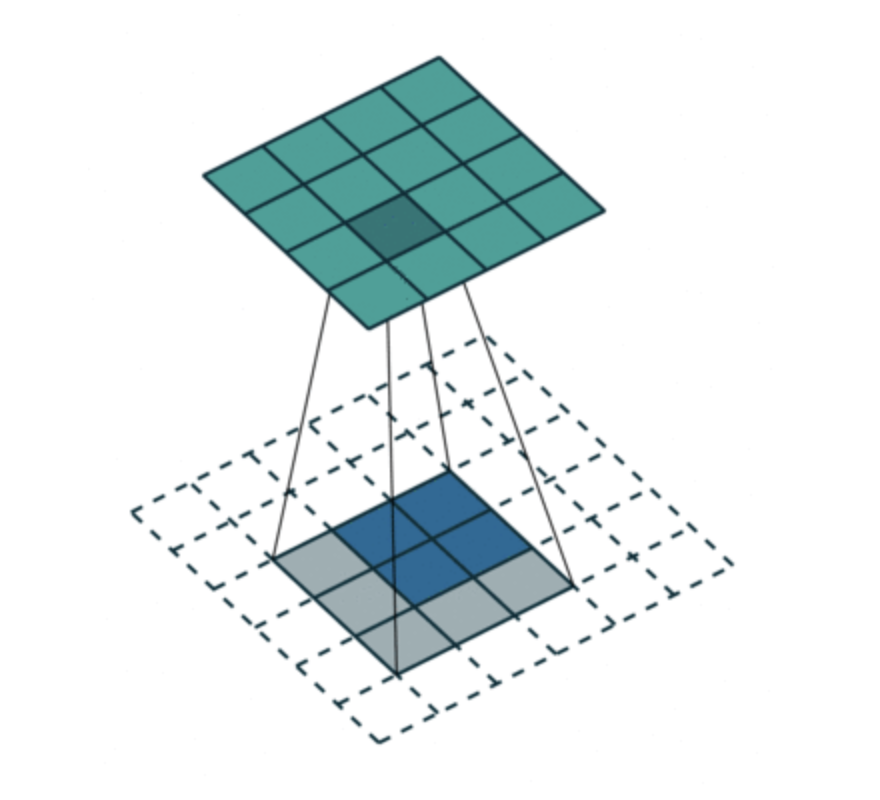
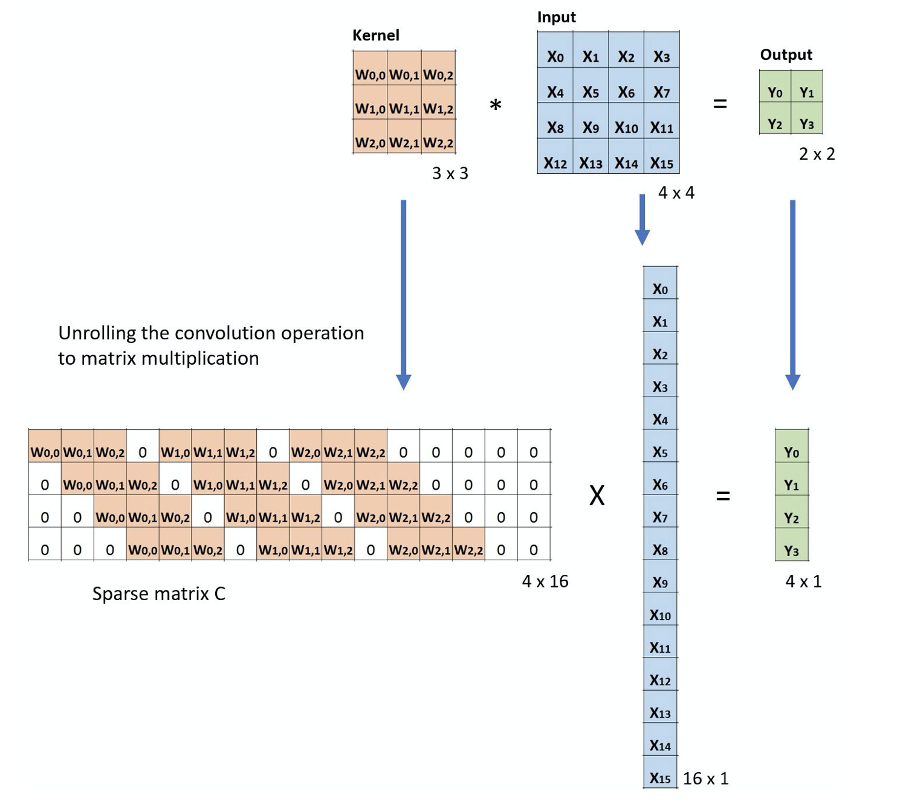
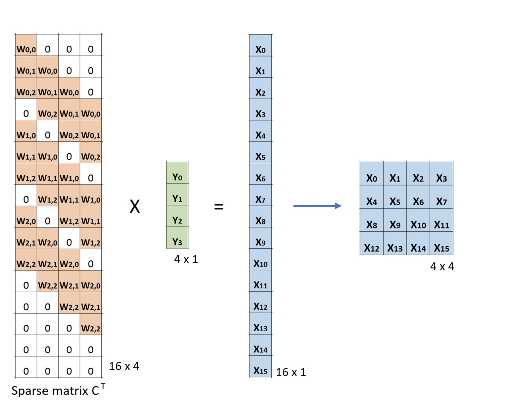
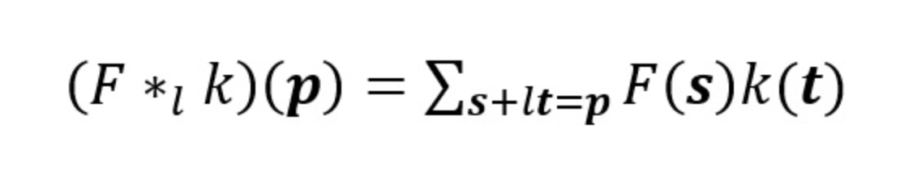
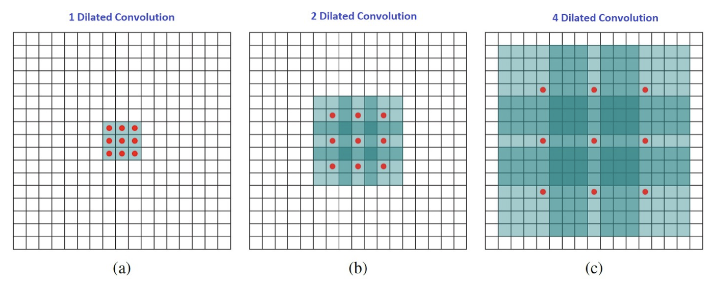
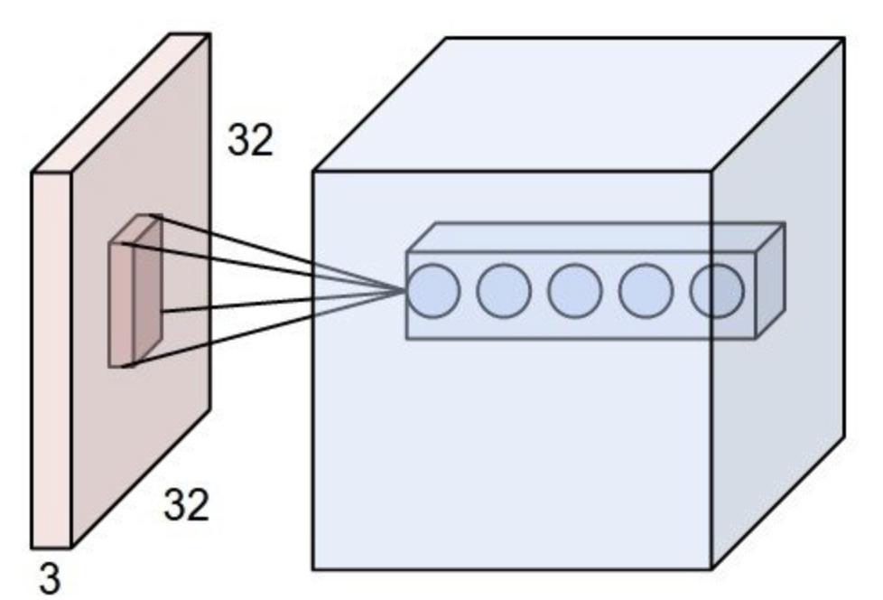

#Kinds of CNN and its Mean 

###**(1) motivation**

- PRML에서 backpropagation의 efficiency를 계산하는 부분을 공부하다, Sparse connections 라는 용어를 보게 되고 검색을 하고 공부하게 되었다.
---------------------------------------

###**(2) Mean of Sparse**

- Sparse 의미는 직역하면, '부족한'의 의미를 갖는다. network science에선 '가능한 모든 링크'보다 적은 즉,maximum 링크의 개수보다 적은 수의 링크를 가지면,
그 네트워크는 sparse network라고한다. 이는 총 n(n-1)/2의 개수보다 적은 링크를 가진다면, sparse하다고 한다. 그러나 Deep neural network에서
Fully connect network는 **n(n-1)/2**의 링크를 가지지 않음에도 일반적으로는 sparse하다고 표현하지는 않는다. 의미적으로는 이 FCN(fully connected network)과
Sparse network는 대조적인 의미를 가지는데, 그렇다면 Sparse network의 유형은 도대체 무엇이 있을 수 있느냐? 의문을 가질 수 있을 것이다. 이 의문에 대한 답을 하기전에 먼저 
Sparse matrix를 보고 가야한다.
---------------------------------------
###**(3) Sparse matrix vs Dense matrix**

- sparse matrix, 희소행렬이란 위키백과의 정의를 빌리자면, 값이 대부분 0인 경우를 가리키는 표현이라고한다.
그렇다면, 반대의 의미를 지니는 Dense matrix는? 
우리가 선형대수 시간 때, 많이 사용한 것 처럼 속이 아주 꽉 찬 행렬이다.
---------------------------------------  
###**(4) Convolution vs Cross-correlation in CNN** 

- 대표적인 Sparse network는 바로 Convolutional neural network이다. 
그 이유는 바로 Convolutional 연산에 의해 생기는 matrix의 형태가 바로 Sparse 한 형태이기 때문이다.

</img>

- 합성곱이라는 의미 답게 두개의 함수가 합성함수처럼 겹쳐진 함수인데, 통계적인 의미로는 f,g의 distribution에서 겹치는 영역의 넓이를 알고
싶은데, 이를 구하기 위해 두 분포에 곱을 한 후 여기에 적분을 취하여 넓이를 구하는 것이다. 겹치지 않는 부분은 한쪽은 0의 분포를 가지기 때문에 곱하면
0이 되버리기 때문에, 겹치는 부분만 살아남게 되는 것이다. 그러나 여기서 주의점이 있다. Convolution 연산은 적분으로 CDF를 구하기 전에, 한 함수를 shift하거나 revserse 한 후에 적용한 것이다.
단순히 두 함수 혹은 두 분포의 겹치는 부분만 적분하여 구하는 것은 Cross-correlation이라고 부른다.

</img>

- 이와 같은 개념이 CNN연산 방식에도 적용되어 있다. 엄밀히 CNN에서 필터는 reverse 되어있지 않은 Cross-correlation이 filter라고 보면 되는 것이다. 그냥 편해서 이름만 CNN이라고 부른다고 한다.
Convolution의 주목적은 어쨌든 filter를 적용시켜서 입력으로부터 feature extraction을 하기 위함이다.

</img>

- 일반적인 CNN에서 필터를 적용시키면(패딩 이런거 안쓰고), 필터의 행렬곱에 의해 더 적어진 피쳐맵이 뽑힌 행렬의 결과가 나오게 된다.

- 당연히 필터도 다차원의 필터를 적용하는 것이 가능하고, 이경우 다음 그림과 같은 형태로 연산이 이루어진다.

</img>

 
---------------------------------------  
---------------------------------------  

###**(5) Mean Of 1 x 1 Convolution** 
- 이전까지 단순히 입력에 대해 필터를 곱하는 작업을 했었는데 이 연산을 레이어들에 대해서 단 하나의 채널에 단 하나의 엘리먼트를 갖는 필터를 곱하는
작업이 갖는 것을 볼 것인데, 도대체 이게 무슨 의미를 가지는 지에 볼것이다.
그전에 입력 레이어가 멀티채널을 가지고 있으면 다음 그림처럼 1x1에서 다음 그림처럼 depth에 해당하는 채널만 맞춰주는 것이 되는 것이다.

</img>

- inception net 등 여러 네트워크에서 사용되는 1x1의 convolution의 이점은 크게 3가지로 볼 수 있다.

1. 효율적인 연산을 위한 차원 감소이다.

2. 효율적으로 저차원에서 임베딩을 하거나 feature pooling을 한다는 점.

3. Convolution 이후에 다시 비선형성을 적용 시킨다는 점이다.

- 1,2의 장점은 이미 위 그림에서 보면 유추할수 있다, 매번 1x1의 연산을 끝낼 때마다 상당한 차원 축소를 하게 해주는 것이고, 3의 장점인 
1x1 convolution의 이후 Relu같은 비선형 함수를 추가할 수 있다는 것이다. 이러한 비선형 함수는 네트워크를 더 복잡하게 만들어주는 역할을 한다.
  
- Yann LeCun에 따르면, 1x1 convolution은 CNN내에서 유일한 fully-connected network라고 언급하였다. 이는 1x1의 필터가 모든 테이블과 연결되어서 연산되어지기 때문이다.
즉, 각 테이블의 차원을 대표하는 값 하나를 뽑아내는 것을 의미한다.

---------------------------------------  
###**(6) Transposed Convolution (Deconvolution)** 

- 많은 network에서 가끔 convolution의 반대방향으로 변환을 해야할 때가 있다. 즉, 압축된 피쳐로부터 다시 원래 이미지를 생성하는 작업 예를들면, 오토 인코더나 세그멘테이션 작업이다.
전통적인 방법으론 interpolation 스키마를 적용시킨다던가 어떤 creating 법칙을 정해서 그 법칙을 따라서 값을 확장해 나가는 식(호프만 코드 같은 방법인듯)으로 복원했었는데, 뉴럴넷 자체로 적절한 변환방법을 익히게하여
  복원시키는것이 트랜드라고 한다. 이를 transpose Convolution이고 deconvolution이라고 알려져 있다. 참고 신호처리에서 deconvolution은 이 방식에 해당되지 않음을 알고가자. 대표적인 deconvolution의 동작 방식은 다음그림과 같다.

</img>

- 2x2의 임베딩된 피쳐로부터 3x3의 필터를 씌우는 연산을 반복하여 4x4로 확장하는 것인데, 이를 upsampling한다고 한다. 나머지 외벽에 있는 값들은 따로 안정해주면 다 0으로 가정한다.
그런데 여기서 여러가지 시도들이 등장하는데 단순한 2x2의 임베딩된 입력 값인데 이 입력값들 사이에 1의 제로 패딩을 추가하면 다음과 같이 되고 크기의 결과는 5x5로 변하게 된다.

</img>

자 그러면 다시 입력 이미지로부터, 첫 질문에 대한 답인 왜 Sparse한지에 대한 결론을 내릴 때가 왔다.

---------------------------------------  
###**(7) Sparse Matrix in CNN** 

- CNN에서 필터가 이미지를 돌면서 feature extraction을 하는데, 여기서 filter를 Kernal 이라고도 부른다. 이 feature extraction을 하는 것을 
수학적인 matrix multiplication인 관점으로 펼쳐서 보면 다음과 같이 된다.
  

</img>

- 그림에서 보면 중간중간에 0이 들어간 것이 있는데, 이는 하나의 필터 연산에 대응되지 않는 이미지에 대한 표시이다. 이러한 성질 때문에 이는
Sparse matrix가 되고 Sparse하다고 표현하는 것이다. 그렇다면! deconvolution할때는 어떻게 될 것인가?
  deconvolution을 할때는 임베딩으로부터 이미지를 복원 시켜야한다. 또한 deconvolution이 convolution의 transpose라고 했던가? 그렇다면, 위 그림에서 kernal을 tranpose 취하고 입력이 아웃풋이 되고 아웃풋이 입력이되게 서로 맞바꾸면
  될거 같지 않은가??

</img>

- 예상한대로의 구조를 지닌다. 

---------------------------------------  
###**(8) Dilated Convolution (Atrous Convolution)** 
- Dilated의 직역은 '확장한다 이다.'Dilated convolution'도 역시 많은 논문에서 등장한다. 우선 일반적인 convolution과 Dilated convolution 수식부터 비교를 해보자 다음이 일반적인 discrete한 convolution의 연산에 대한 수식이다.

</img>

- 다음은 Dilated convolution의 대한 수식이다.

- 여기에 l이 추가된 것이 볼수 있는데, 이 의미 바로 필터간의 확장계이라 볼수 있다. 무슨 말인고 하니 이게 1이면 일반적인 convoution의 필터와 같아진다. 다음 그림을 보면
쉽게 이해할 수 있을 것이다!

- 필터간의 칸을 l-1의 크기만큼 띄우는 역할을 한다. 이 Dilated convolution의 이점은 필터 크기의 증가 없이 싼 코스트에 광범위하 receptive filed를 확장할 수 있다는 것이다.(receptive filed가 뭔지 모르겠다면 <a href="#rf">여기</a> 참조)
- 또한 거대한 receptive field를 이용하여 정보 손실이 적으며, 최신 semantic segmentation의 작업에 자주 활용 된다고 한다.

--------------------------------------- 

###**
(EXTRA) receptive field
**

- receptive field 는 출력 레이어의 뉴런 하나에 영향을 미치는 입력 뉴런들의 공간 크기이다.

- 위그림과 같이 입력이 32x32x3 (RGB image) 인 경우 가중치(필터)의 크기가 [5x5x3] 이라면
  receptive field 는 5x5x3 이 된다. 필터의 크기와 같다

