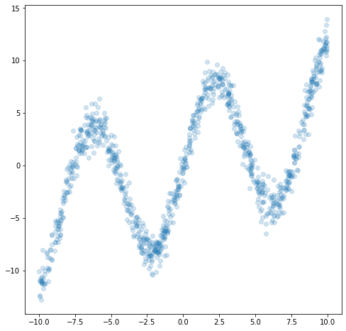
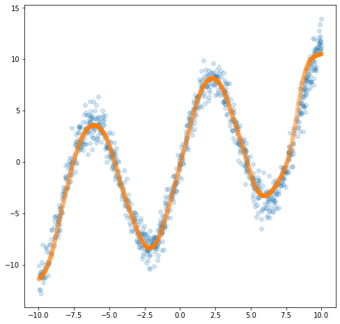
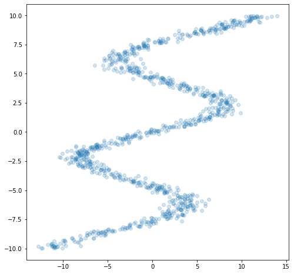
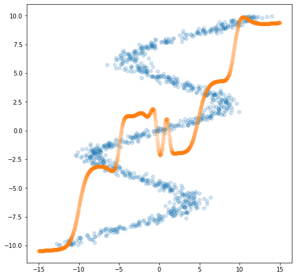
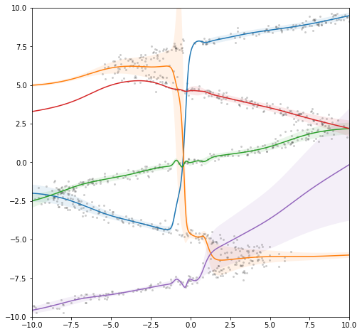
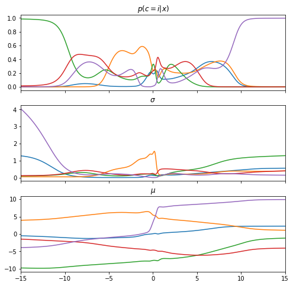
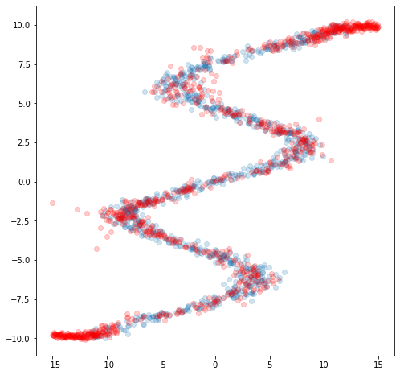

# Mixture Of Density Network

- Author: Sung uk Jung
- Tags: Mixture Of Density Network(MDN), PRML5.6
- 리뷰여부: Yes
- Christopher Michael Bishop,Byong gu Kang


The goal of supervised learning is to model a conditional distribution $p(t|x)$, which for many simple regression problems is chosen to be Gaussian.
However, practical machine learning problems can often have significantly non-Gaussian distributions. These can arise, for example, with <strong>inverse problems</strong> in which the distribution can be multimodal, in which case the Gaussian assumption can lead to very poor predictions.

Inverse Problem:결과값이 같아도 원인은 다른 여러가지 현상이 있을 수 있습니다. 아주 간단한 예로, 우리가 숫자 x와 y를 더해 결과 z를 얻는다고 생각하면 forward problem인 x와 y가 주어졌을 때 z를 얻는 문제는 답을 쉽게 얻을 수 있고 답이 하나 뿐입니다. 반대로 inverse problem인 z가 있을 때 x와 y를 구하는 문제는 답이 여러 개 (이 문제의 경우 무한대로 많음) 있지요.

<strong>Mixture Of Density Network</strong>은 이러한 inverse problems을 해결하는 하나의 방법이 될 수 있음


```python
import matplotlib.pyplot as plt
import numpy as np
import torch
import torch.nn as nn
from torch.autograd import Variable
```


```python
def generate_data(n_samples):
    epsilon = np.random.normal(size=(n_samples))
    x_data = np.random.uniform(-10, 10, n_samples)
    y_data = 7*np.sin(0.75*x_data) + 0.5*x_data + epsilon
    return x_data, y_data

n_samples = 1000
x_data, y_data = generate_data(n_samples)
```

-10과 10의 사이의 랜덤으로 뽑은 정규분포를 가지는 랜덤변수로
$$y(
x
)
=
7
sin
(
0.75
x
)
+
0.5
x
+
ϵ$$
의 분포도를 가지는 데이터를 생성한다


```python
plt.figure(figsize=(8, 8))
plt.scatter(x_data, y_data, alpha=0.2)
plt.show()
```


    

    


20개의 hidden layer을 가지는 2계층의 단순한 fullyconnected network와 Mean Square error를 cost 함수로 사용한다.


```python
n_input = 1
n_hidden = 20
n_output = 1

network = nn.Sequential(nn.Linear(n_input, n_hidden),
                        nn.Tanh(),
                        nn.Linear(n_hidden, n_output))
loss_fn = nn.MSELoss()
```


```python
x_tensor = torch.from_numpy(np.float32(x_data).reshape(n_samples, n_input))
y_tensor = torch.from_numpy(np.float32(y_data).reshape(n_samples, n_input))
x_variable = Variable(x_tensor)
y_variable = Variable(y_tensor, requires_grad=False)
```

Naive한 SGD를 이용하여, 3000번 학습 시키고 300번마다 그 결과를 출력하는 코드이다.


```python
optimizer = torch.optim.SGD(network.parameters(), lr=0.01)
def train():
    for epoch in range(3000):
        y_pred = network(x_variable)
        loss = loss_fn(y_pred, y_variable)
        optimizer.zero_grad()
        loss.backward()
        optimizer.step()

        if epoch % 300 == 0:
            print(epoch,'loss:', loss.data.numpy())

train()
```

    0 loss: 1.2974079
    300 loss: 1.2913082
    600 loss: 1.2853305
    900 loss: 1.2794465
    1200 loss: 1.2736479
    1500 loss: 1.2679135
    1800 loss: 1.2622292
    2100 loss: 1.256591
    2400 loss: 1.2509865
    2700 loss: 1.2454135


학습후 
$$y(
x
)
=
7
sin
(
0.75
x
)
+
0.5
x
+
ϵ$$
의 공식으로 랜덤하게 만들어 둔 테스트 데이터를 넣어보고 트레인 데이터와 비교하는 곡선을 그린다.


```python
x_test_data = np.linspace(-10, 10, n_samples)

x_test_tensor = torch.from_numpy(np.float32(x_test_data).reshape(n_samples, n_input))
x_test_variable = Variable(x_test_tensor)
y_test_variable = network(x_test_variable)

y_test_data = y_test_variable.data.numpy()

plt.figure(figsize=(8, 8))
plt.scatter(x_data, y_data, alpha=0.2)
plt.scatter(x_test_data, y_test_data, alpha=0.2)
plt.show()
```


    

    


비교적 아주 깔끔하게 학습되어있는 것을 볼 수있는데, 그 이유는 <strong>Universal approximation theorem</strong>과 어느정도 관련이 있다.
Multi-Layer Perceptron은 어떠한 임의의 연속함수를 근사할 수 있는데, 여기서 한가지 제약이 붙는다. 바로 one-to-one인 경우와 many-to-one의 경우 즉 다수의 x값들이 존재하더라도 단 하나의 y의 출력을 가지는 경우에만 이 법칙이 성립한다. 그렇다면, 하나의 x 혹은 다수의 x에 대해 여러가지의 출력을 가지는 경우 어떻게 될것인지 고려해 볼 수 있다.

## exchange rules of x and y 

본 예제에서 x와 y를 서로 tranpose하게 바꿔버리면 one-many 즉, 하나의 x에 대해 여러 출력을 갖는 problem으로 바뀌어 버리는 것이다.


```python
plt.figure(figsize=(8, 8))
plt.scatter(y_data, x_data, alpha=0.2)
plt.show()
```


    

    


이는 달리말하면, y에 대해 이전에는 하나의 정규분포를 갖는 문제였다면, 지금은 여러개의 정규분포가 혼합된 mixture Of Gaussian이 되어버렸는데 이 경우 위에서 사용했던 모델로 다시 학습을 시켜보겠다.


```python
x_variable.data = y_tensor
y_variable.data = x_tensor

train()
```

    0 loss: 20.97882
    300 loss: 20.966125
    600 loss: 20.955046
    900 loss: 20.945293
    1200 loss: 20.936745
    1500 loss: 20.92931
    1800 loss: 20.922855
    2100 loss: 20.917227
    2400 loss: 20.912277
    2700 loss: 20.90788


```python
x_test_data = np.linspace(-15, 15, n_samples)
x_test_tensor = torch.from_numpy(np.float32(x_test_data).reshape(n_samples, n_input))
x_test_variable.data = x_test_tensor

y_test_variable = network(x_test_variable)

# move from torch back to numpy
y_test_data = y_test_variable.data.numpy()

# plot the original data and the test data
plt.figure(figsize=(8, 8))
plt.scatter(y_data, x_data, alpha=0.2)
plt.scatter(x_test_data, y_test_data, alpha=0.2)
plt.show()
```


    

    


다른 x값에도 중복되는 y의 값들 때문에 모델이 혼동하는 것을 볼 수 있는데, 이 문제를 앞서말한 다수의 정규분포로 해결하기 위해 등장 한 것이 바로 Mixture Density Network, MDN이다. 같은 x에 대해서 다른 분포를 따르는 y에서 
$p
(
y
∣
x
)$
를 예측하는 것이다. 이를 표현하는데 있어서 여러 분포가 가능(inverse problem)하지만, 여기서는 정규분포만을 가정하고 접근해 본다.
$$
p
(
y
∣
x
)
=
∑_
{i=1}^
n
p
(
c
=
i
∣
x
)
N
(
y
;
μ_
i
,
σ_
i
)
$$
여기서 $p
(
c
=
i
∣
x
)
$는 각 정규분포에서 c가 나올 확률이다. 즉, n개의 정규분포를 가정을 하고, 각 분포에서 y가 나올 확률을 이 분포에 속할 확률과 곱해서 결과를 예측을 하는 것으로 이렇게 
$p
(
y
∣
x
)$
를 만들어낸다음에는 샘플링을 통해 최종 예측을 해준다. 또한, $p
(
c
=
i
∣
x
)$
 의 경우에는 모두 다 더해서 1이 되어야한다는 제약이 있으므로 softmax를 사용해 이를 normalize해줘야하고 σ의 경우 무조건 양수가 되어야한다는 전제가 있어서 exp를 취해줄것이다. 그리고 mixtrue of gaussian의 문제가 되었으므로, MSE가 아닌 Cross Entropy error 함수를 사용한다.
$$
E=−logm∑_{i=
1}^mp
(
c
=
i
∣
x
)
N
(
y
;
μ_
i
,
σ_
i
)
$$

아래는 가우시안 분포를 생성하는 함수이다.
$$
N
(
μ
,
σ
)
(
x
)
=
1
σ
√
2
π
exp
(
−
(
x
−
μ
)^
2
2
σ^
2
)
$$


```python
oneDivSqrtTwoPI = 1.0 / np.sqrt(2.0*np.pi)
def gaussian_distribution(y, mu, sigma):
    result = (y.expand_as(mu) - mu) * torch.reciprocal(sigma)
    result = -0.5 * (result * result)
    return (torch.exp(result) * torch.reciprocal(sigma)) * oneDivSqrtTwoPI
```

각 분포로부터 y가 나올 확률과 그 분포에 대응할 확률을 곱하고, 이들을 다 더한다음 로그와 평균을 취해주는 loss 함수가된다.


```python
def mdn_loss_fn(pi, sigma, mu, y):
    result = gaussian_distribution(y, mu, sigma) * pi
    result = torch.sum(result, dim=1)
    result = -torch.log(result)
    return torch.mean(result)
```


```python
class MDN(nn.Module):
    def __init__(self, n_hidden, n_gaussians):
        super(MDN, self).__init__()
        self.z_h = nn.Sequential(
            nn.Linear(1, n_hidden),
            nn.Tanh()
        )
        self.z_pi = nn.Linear(n_hidden, n_gaussians)
        self.z_sigma = nn.Linear(n_hidden, n_gaussians)
        self.z_mu = nn.Linear(n_hidden, n_gaussians)  

    def forward(self, x):
        z_h = self.z_h(x)
        pi = nn.functional.softmax(self.z_pi(z_h), -1)
        sigma = torch.exp(self.z_sigma(z_h))
        mu = self.z_mu(z_h)
        return pi, sigma, mu
```

본 문서에서는 20개의 hiddeen layer들과 5개의 가우시안으로 나타낼 것이고 엄밀히 말해서 임의의 평균값과 분산그리고 해당 분포에서의 $p(C=i|x)$를 모델에서 미리 정해주고 학습을 통해서 생성되는 파라메터와 분포도들이 문제를 해결 할수 있도록 나오게하는 목적인 것이다.


```python
network = MDN(n_hidden=20, n_gaussians=5)
optimizer = torch.optim.Adam(network.parameters())
```


```python
mdn_x_data = y_data
mdn_y_data = x_data

mdn_x_tensor = y_tensor
mdn_y_tensor = x_tensor

x_variable = Variable(mdn_x_tensor)
y_variable = Variable(mdn_y_tensor, requires_grad=False)
```


```python
def train_mdn():
    for epoch in range(10000):
        pi_variable, sigma_variable, mu_variable = network(x_variable)
        loss = mdn_loss_fn(pi_variable, sigma_variable, mu_variable, y_variable)
        optimizer.zero_grad()
        loss.backward()
        optimizer.step()

        if epoch % 500 == 0:
            print(epoch, loss.data.numpy())

train_mdn()
```

    0 11.141894
    500 2.8840718
    1000 2.6185617
    1500 2.3492007
    2000 1.9496758
    2500 1.693378
    3000 1.5617992
    3500 1.4878252
    4000 1.4551575
    4500 1.4329038
    5000 1.4178694
    5500 1.4042015
    6000 1.3844061
    6500 1.3556346
    7000 1.331209
    7500 1.322309
    8000 1.3121248
    8500 1.302546
    9000 1.29479
    9500 1.2943642


```python
pi_variable, sigma_variable, mu_variable = network(x_test_variable)

pi_data = pi_variable.data.numpy()
sigma_data = sigma_variable.data.numpy()
mu_data = mu_variable.data.numpy()

plt.figure(figsize=(8, 8), facecolor='white')
for mu_k, sigma_k in zip(mu_data.T, sigma_data.T):
    plt.plot(x_test_data, mu_k)
    plt.fill_between(x_test_data, mu_k-sigma_k, mu_k+sigma_k, alpha=0.1)
plt.scatter(mdn_x_data, mdn_y_data, marker='.', lw=0, alpha=0.2, c='black')
plt.xlim([-10,10])
plt.ylim([-10,10])
plt.show()
```


    

    


```python
fig, (ax1, ax2, ax3) = plt.subplots(3, 1, sharex=True, figsize=(8,8))
ax1.plot(x_test_data, pi_data)
ax1.set_title('$p(c = i | x)$')
ax2.plot(x_test_data, sigma_data)
ax2.set_title('$\sigma$')
ax3.plot(x_test_data, mu_data)
ax3.set_title('$\mu$')
plt.xlim([-15,15])
plt.show()
```


    

    


보다 시피 여러가지의 정규분포가 혼합되어있는데, 우리는 이중에서 선택적으로 구간에 따라 가장 확률이 높은 분포도를 골라서 사용하여 모델링을 할 수 있는데, 이를 가능하게 하는 것이 바로 Gumbel softmax sampling이다. 이것을 자세히 다루는 것은 나중에 하겠다.


```python
def gumbel_sample(x, axis=1):
    z = np.random.gumbel(loc=0, scale=1, size=x.shape)
    return (np.log(x) + z).argmax(axis=axis)

k = gumbel_sample(pi_data)
```


```python
indices = (np.arange(n_samples), k)
rn = np.random.randn(n_samples)
sampled = rn * sigma_data[indices] + mu_data[indices]
```


```python
plt.figure(figsize=(8, 8))
plt.scatter(mdn_x_data, mdn_y_data, alpha=0.2)
plt.scatter(x_test_data, sampled, alpha=0.2, color='red')
plt.show()
```


    

    


기존의 네트워크의 경우에는 하나의 입력에 대해 여러 개의 경우가 가능한 경우에 효과적으로 대응할 수 없었다. MDN은 이러한 문제를 해결하고자 등장했고, 여러 개의 정규분포(혹은 다른 분포)의 평균과 분산을 예측하고, 각 정규분포에 속할 확률을 통해 이를 효과적으로 근사할 수 있게 한 것이다.


```python

```
