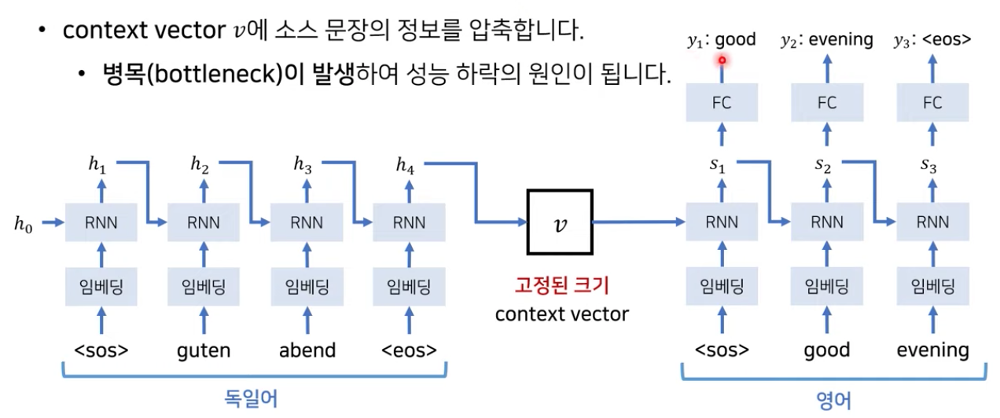
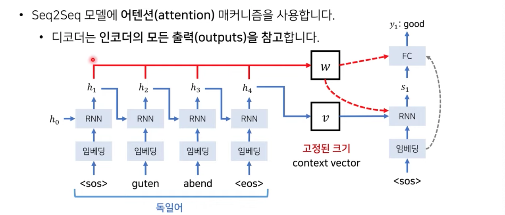
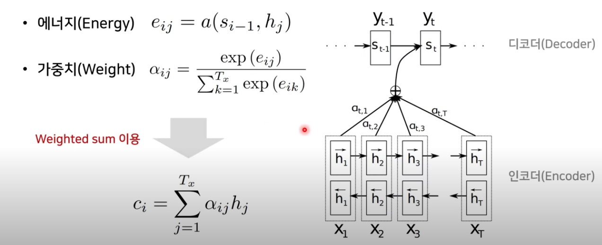
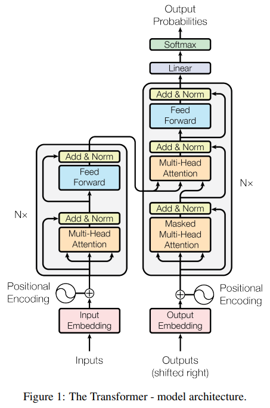
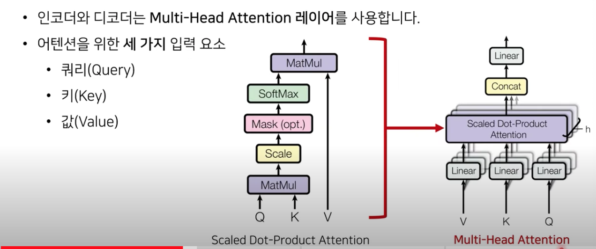
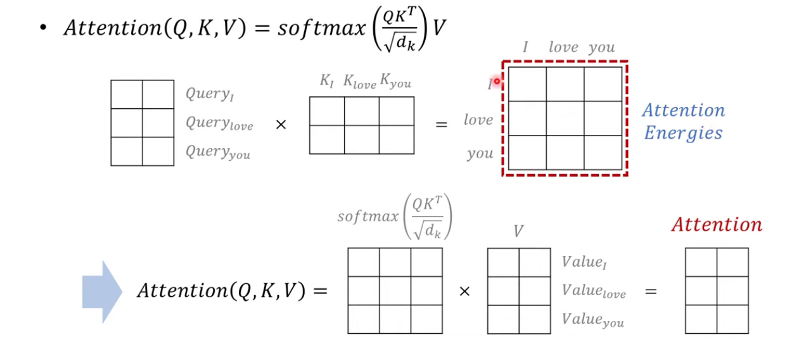
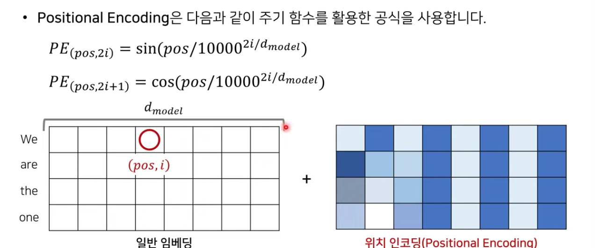

# Transformer Revisited

- Author: Kyungmin Lee
- Link: https://www.youtube.com/watch?v=AA621UofTUA&t=712s
- Tags: NLP, transformer, Attention
- Thesis: Transformer has a big potential.
- 리뷰여부: Yes

  

## Development of NLP

---

- RNN → LSTM → Seq2Seq → Attention → Transformer → GPT-1 → BERT → GPT-3

### 기존 모델의 한계점

- **Context vector** $v$ summarizes information from source sentences. ⇒ **Bottleneck** happened 

  

- Decoder can check context vector every time; however the size of context vector is **limited.**

- What if decoder imports **whole source sentences** at each tim?

  ⇒ Seq2Seq with Attention 

- write every $h_i$ to vector $w$ for global context → make **energy** constant with $w$ & $v$ with matrix multiplication & weighted sum : figure out what words in source sentence to focus on

  $$ energy = e_{ij}=a(s_{i-1},h_j),\qquad weight=\frac{exp(e_{ij})}{Σ^{T_x}_{k=1}exp(e_{ik})},\quad c_i=Σ^{T_x}_{j=1}a_{ij}h_j$$ 

  

- Decoder creates next word with **weighted sum of energy from encoders source sentences**

- Attention also is great at visualization with input & output relationship which is difficult in general deep learning in which it contains a plethora of parameters


## Transformer

---

- Does not use RNN or CNN at all! ⇒ instead use **Positional Encoding** which helps to present sequence information

- comprise Encoder-Decoder Structure : Attention procedure is repeated through multiple layers

  

### Embedding

- sentence proceeds Embedding : since input dimension is equal to the sort of words in a specific language and described as One-Hot Encoding, Embedding makes them into smaller matrix with more continuous values $(d_{word} \times d_{embed})$ 
- Not to use RNN, Embedding has to corporate positional information. ⇒ Positional encoding

### Encoder

- Gets input which has sentence & position information
- Self-attention : to find similarity of each components with attention score ⇒ advantage in context information
- Residual learning : ResNet → skip layer earns original data & trains only remaining information → easier training & faster convergence & higher likelihood to find global optima
- Normalization
- Feedforward 
- Each layer has different parameters
- Output from the last encoder is introduced to all decoder layers.

### Decoder 

- 1st, Self-attention : learn sentence's context
- 2nd, Encoder-Decoder Attention : introduce encoder information → learn how decoder output is similar with the source sentence in global context
- decoder doesn't stop without <eos>
- num of encoder layers = num of decoder layers

### Multi-Head Attention



- attention mechanism : find how some word is related with other words

  - Query : things that questions ("some word")
  - Key : thngs that answers ("other words")
  - Value : similarity values (weighted sum of relation)

- Multi-Head Attention : different kinds ("heads") to learn different attention concepts that learns more segmented features

  - to match input & output dimension : Concatenation & Linear

  $$ Attention(Q,K,V)=softmax(\frac{QK^T}{\sqrt d_k})V\\head_i=Attention(QW^Q_i, KW_i^K, VW_i^V)\\MultiHead(Q,K,V)=Concat(head_1,...,head_h)W^O$$
  - scaling factor : to prevent gradient vanishing since softmax has 0 at origin

- Scaled Dot-Product Attention

  

  - Mask matrix($-\infty$) enables to ignore specific word.
  - Each head has attention of query, key, value


### Kind of Attention

1. Encoder Self-Attention : figure out similarity & representation of each other component
2. Masked Decoder Self-Attention : attention of only previously positioned words to proper learning
3. Encoder-Decoder Attention : decoder has query & encoder has key and value


### Positional Encoding



- Enter relative positional information of each word to the network with periodic function
- Any function that lets the network learn the periodicity is acceptable. 


## Source Code

---

### **Multi Head Attention 아키텍처**

* 어텐션(attention)은 <b>세 가지 요소</b>를 입력으로 받습니다.
  - <b>쿼리(queries)</b>
  - **키(keys)**
  - <b>값(values)</b>

​    \* 현재 구현에서는 Query, Key, Value의 차원이 모두 같습니다. 

- 하이퍼 파라미터(hyperparameter)
  - ***\*hidden_dim\****: 하나의 단어에 대한 임베딩 차원
  - ***\*n_heads\****: 헤드(head)의 개수 = scaled dot-product attention의 개수
  - ***\*dropout_ratio\****: 드롭아웃(dropout) 비율

```python
import torch.nn as nn

class MultiHeadAttentionLayer(nn.Module):
    def __init__(self, hidden_dim, n_heads, dropout_ratio, device):
        super().__init__()

        assert hidden_dim % n_heads == 0

        self.hidden_dim = hidden_dim # 임베딩 차원
        self.n_heads = n_heads # 헤드(head)의 개수: 서로 다른 어텐션(attention) 컨셉의 수
        self.head_dim = hidden_dim // n_heads # 각 헤드(head)에서의 임베딩 차원

        self.fc_q = nn.Linear(hidden_dim, hidden_dim) # Query 값에 적용될 FC 레이어
        self.fc_k = nn.Linear(hidden_dim, hidden_dim) # Key 값에 적용될 FC 레이어
        self.fc_v = nn.Linear(hidden_dim, hidden_dim) # Value 값에 적용될 FC 레이어

        self.fc_o = nn.Linear(hidden_dim, hidden_dim)

        self.dropout = nn.Dropout(dropout_ratio)

        self.scale = torch.sqrt(torch.FloatTensor([self.head_dim])).to(device)

    def forward(self, query, key, value, mask = None):

        batch_size = query.shape[0]

        # query: [batch_size, query_len, hidden_dim]
        # key: [batch_size, key_len, hidden_dim]
        # value: [batch_size, value_len, hidden_dim]
 
        Q = self.fc_q(query)
        K = self.fc_k(key)
        V = self.fc_v(value)

        # Q: [batch_size, query_len, hidden_dim]
        # K: [batch_size, key_len, hidden_dim]
        # V: [batch_size, value_len, hidden_dim]

        # hidden_dim → n_heads X head_dim 형태로 변형
        # n_heads(h)개의 서로 다른 어텐션(attention) 컨셉을 학습하도록 유도
        Q = Q.view(batch_size, -1, self.n_heads, self.head_dim).permute(0, 2, 1, 3)
        K = K.view(batch_size, -1, self.n_heads, self.head_dim).permute(0, 2, 1, 3)
        V = V.view(batch_size, -1, self.n_heads, self.head_dim).permute(0, 2, 1, 3)

        # Q: [batch_size, n_heads, query_len, head_dim]
        # K: [batch_size, n_heads, key_len, head_dim]
        # V: [batch_size, n_heads, value_len, head_dim]

        # Attention Energy 계산
        energy = torch.matmul(Q, K.permute(0, 1, 3, 2)) / self.scale

        # energy: [batch_size, n_heads, query_len, key_len]

        # 마스크(mask)를 사용하는 경우
        if mask is not None:
            # 마스크(mask) 값이 0인 부분을 -1e10으로 채우기
            energy = energy.masked_fill(mask==0, -1e10)

        # 어텐션(attention) 스코어 계산: 각 단어에 대한 확률 값
        attention = torch.softmax(energy, dim=-1)

        # attention: [batch_size, n_heads, query_len, key_len]

        # 여기에서 Scaled Dot-Product Attention을 계산
        x = torch.matmul(self.dropout(attention), V)

        # x: [batch_size, n_heads, query_len, head_dim]

        x = x.permute(0, 2, 1, 3).contiguous()

        # x: [batch_size, query_len, n_heads, head_dim]

        x = x.view(batch_size, -1, self.hidden_dim)

        # x: [batch_size, query_len, hidden_dim]

        x = self.fc_o(x)

        # x: [batch_size, query_len, hidden_dim]

        return x, attention
```


### **Position-wise Feedforward 아키텍처**

- 입력과 출력의 차원이 동일합니다.

- 하이퍼 파라미터(hyperparameter)

​    - ***\*hidden_dim\****: 하나의 단어에 대한 임베딩 차원

​    - ***\*pf_dim\****: Feedforward 레이어에서의 내부 임베딩 차원

​    - ***\*dropout_ratio\****: 드롭아웃(dropout) 비율

```python
class PositionwiseFeedforwardLayer(nn.Module):
    def __init__(self, hidden_dim, pf_dim, dropout_ratio):
        super().__init__()

        self.fc_1 = nn.Linear(hidden_dim, pf_dim)
        self.fc_2 = nn.Linear(pf_dim, hidden_dim)

        self.dropout = nn.Dropout(dropout_ratio)

    def forward(self, x):

        # x: [batch_size, seq_len, hidden_dim]

        x = self.dropout(torch.relu(self.fc_1(x)))

        # x: [batch_size, seq_len, pf_dim]

        x = self.fc_2(x)

        # x: [batch_size, seq_len, hidden_dim]

        return x
```

 ### Encoder 레이어 아키텍처

- 하나의 인코더 레이어에 대해 정의합니다.

  - 입력과 출력의 차원이 같습니다.
  - 이러한 특징을 이용해 트랜스포머의 인코더는 인코더 레이어를 여러 번 중첩해 사용합니다.

- 하이퍼 파라미터(hyperparameter)

  - **hidden_dim**: 하나의 단어에 대한 임베딩 차원
  - **n_heads**: 헤드(head)의 개수 = scaled dot-product attention의 개수
  - **pf_dim**: Feedforward 레이어에서의 내부 임베딩 차원
  - **dropout_ratio**: 드롭아웃(dropout) 비율

- <pad> 토큰에 대하여 마스크(mask) 값을 0으로 설정합니다.

- ```python
  class EncoderLayer(nn.Module):
      def __init__(self, hidden_dim, n_heads, pf_dim, dropout_ratio, device):
          super().__init__()
  
          self.self_attn_layer_norm = nn.LayerNorm(hidden_dim)
          self.ff_layer_norm = nn.LayerNorm(hidden_dim)
          self.self_attention = MultiHeadAttentionLayer(hidden_dim, n_heads, dropout_ratio, device)
          self.positionwise_feedforward = PositionwiseFeedforwardLayer(hidden_dim, pf_dim, dropout_ratio)
          self.dropout = nn.Dropout(dropout_ratio)
  
      # 하나의 임베딩이 복제되어 Query, Key, Value로 입력되는 방식
      def forward(self, src, src_mask):
  
          # src: [batch_size, src_len, hidden_dim]
          # src_mask: [batch_size, src_len]
  
          # self attention
          # 필요한 경우 마스크(mask) 행렬을 이용하여 어텐션(attention)할 단어를 조절 가능
          _src, _ = self.self_attention(src, src, src, src_mask)
  
          # dropout, residual connection and layer norm
          src = self.self_attn_layer_norm(src + self.dropout(_src))
  
          # src: [batch_size, src_len, hidden_dim]
  
          # position-wise feedforward
          _src = self.positionwise_feedforward(src)
  
          # dropout, residual and layer norm
          src = self.ff_layer_norm(src + self.dropout(_src))
  
          # src: [batch_size, src_len, hidden_dim]
  
          return src
  ```


### Encoder 아키텍쳐

- 전체 인코더 아키텍처를 정의합니다.

- 하이퍼 파라미터(hyperparameter)

  - **input_dim**: 하나의 단어에 대한 원 핫 인코딩 차원
  - **hidden_dim**: 하나의 단어에 대한 임베딩 차원
  - **n_layers**: 내부적으로 사용할 인코더 레이어의 개수
  - **n_heads**: 헤드(head)의 개수 = scaled dot-product attention의 개수
  - **pf_dim**: Feedforward 레이어에서의 내부 임베딩 차원
  - **dropout_ratio**: 드롭아웃(dropout) 비율
  - **max_length**: 문장 내 최대 단어 개수

- 원본 논문과는 다르게 위치 임베딩(positional embedding)을 학습하는 형태로 구현합니다.

  - BERT와 같은 모던 트랜스포머 아키텍처에서 사용되는 방식입니다.

- <pad> 토큰에 대하여 마스크(mask) 값을 0으로 설정합니다.

  ```python
  class Encoder(nn.Module):
      def __init__(self, input_dim, hidden_dim, n_layers, n_heads, pf_dim, dropout_ratio, device, max_length=100):
          super().__init__()
  
          self.device = device
  
          self.tok_embedding = nn.Embedding(input_dim, hidden_dim)
          self.pos_embedding = nn.Embedding(max_length, hidden_dim)
  
          self.layers = nn.ModuleList([EncoderLayer(hidden_dim, n_heads, pf_dim, dropout_ratio, device) for _ in range(n_layers)])
  
          self.dropout = nn.Dropout(dropout_ratio)
  
          self.scale = torch.sqrt(torch.FloatTensor([hidden_dim])).to(device)
  
      def forward(self, src, src_mask):
  
          # src: [batch_size, src_len]
          # src_mask: [batch_size, src_len]
  
          batch_size = src.shape[0]
          src_len = src.shape[1]
  
          pos = torch.arange(0, src_len).unsqueeze(0).repeat(batch_size, 1).to(self.device)
  
          # pos: [batch_size, src_len]
  
          # 소스 문장의 임베딩과 위치 임베딩을 더한 것을 사용
          src = self.dropout((self.tok_embedding(src) * self.scale) + self.pos_embedding(pos))
  
          # src: [batch_size, src_len, hidden_dim]
  
          # 모든 인코더 레이어를 차례대로 거치면서 순전파(forward) 수행
          for layer in self.layers:
              src = layer(src, src_mask)
  
          # src: [batch_size, src_len, hidden_dim]
  
          return src # 마지막 레이어의 출력을 반환
  ```

  

### **디코더(Decoder) 레이어 아키텍처**

- 하나의 디코더 레이어에 대해 정의합니다.
  - 입력과 출력의 차원이 같습니다.
  - 이러한 특징을 이용해 트랜스포머의 디코더는 디코더 레이어를 여러 번 중첩해 사용합니다.
  - 디코더 레이어에서는 두 개의 Multi-Head Attention 레이어가 사용됩니다.
- 하이퍼 파라미터(hyperparameter)
  - **hidden_dim**: 하나의 단어에 대한 임베딩 차원
  - **n_heads**: 헤드(head)의 개수 = scaled dot-product attention의 개수
  - **pf_dim**: Feedforward 레이어에서의 내부 임베딩 차원
  - **dropout_ratio**: 드롭아웃(dropout) 비율
- 소스 문장의 <pad> 토큰에 대하여 마스크(mask) 값을 0으로 설정합니다.
- 타겟 문장에서 각 단어는 다음 단어가 무엇인지 알 수 없도록(이전 단어만 보도록) 만들기 위해 마스크를 사용합니다.

```python
class DecoderLayer(nn.Module):
    def __init__(self, hidden_dim, n_heads, pf_dim, dropout_ratio, device):
        super().__init__()

        self.self_attn_layer_norm = nn.LayerNorm(hidden_dim)
        self.enc_attn_layer_norm = nn.LayerNorm(hidden_dim)
        self.ff_layer_norm = nn.LayerNorm(hidden_dim)
        self.self_attention = MultiHeadAttentionLayer(hidden_dim, n_heads, dropout_ratio, device)
        self.encoder_attention = MultiHeadAttentionLayer(hidden_dim, n_heads, dropout_ratio, device)
        self.positionwise_feedforward = PositionwiseFeedforwardLayer(hidden_dim, pf_dim, dropout_ratio)
        self.dropout = nn.Dropout(dropout_ratio)

    # 인코더의 출력 값(enc_src)을 어텐션(attention)하는 구조
    def forward(self, trg, enc_src, trg_mask, src_mask):

        # trg: [batch_size, trg_len, hidden_dim]
        # enc_src: [batch_size, src_len, hidden_dim]
        # trg_mask: [batch_size, trg_len]
        # src_mask: [batch_size, src_len]

        # self attention
        # 자기 자신에 대하여 어텐션(attention)
        _trg, _ = self.self_attention(trg, trg, trg, trg_mask)

        # dropout, residual connection and layer norm
        trg = self.self_attn_layer_norm(trg + self.dropout(_trg))

        # trg: [batch_size, trg_len, hidden_dim]

        # encoder attention
        # 디코더의 쿼리(Query)를 이용해 인코더를 어텐션(attention)
        _trg, attention = self.encoder_attention(trg, enc_src, enc_src, src_mask)

        # dropout, residual connection and layer norm
        trg = self.enc_attn_layer_norm(trg + self.dropout(_trg))

        # trg: [batch_size, trg_len, hidden_dim]

        # positionwise feedforward
        _trg = self.positionwise_feedforward(trg)

        # dropout, residual and layer norm
        trg = self.ff_layer_norm(trg + self.dropout(_trg))

        # trg: [batch_size, trg_len, hidden_dim]
        # attention: [batch_size, n_heads, trg_len, src_len]

        return trg, attention
```


### Decoder  아키텍쳐

- 전체 디코더 아키텍처를 정의합니다.
- 하이퍼 파라미터(hyperparameter)
  - **output_dim**: 하나의 단어에 대한 원 핫 인코딩 차원
  - **hidden_dim**: 하나의 단어에 대한 임베딩 차원
  - **n_layers**: 내부적으로 사용할 인코더 레이어의 개수
  - **n_heads**: 헤드(head)의 개수 = scaled dot-product attention의 개수
  - **pf_dim**: Feedforward 레이어에서의 내부 임베딩 차원
  - **dropout_ratio**: 드롭아웃(dropout) 비율
  - **max_length**: 문장 내 최대 단어 개수
- 원본 논문과는 다르게 위치 임베딩(positional embedding)을 학습하는 형태로 구현합니다.
  - BERT와 같은 모던 트랜스포머 아키텍처에서 사용되는 방식입니다.
- Seq2Seq과는 마찬가지로 실제로 추론(inference) 시기에서는 디코더를 반복적으로 넣을 필요가 있습니다.
  - 학습(training) 시기에서는 한 번에 출력 문장을 구해 학습할 수 있습니다.
- 소스 문장의 <pad> 토큰에 대하여 마스크(mask) 값을 0으로 설정합니다.
- 타겟 문장에서 각 단어는 다음 단어가 무엇인지 알 수 없도록(이전 단어만 보도록) 만들기 위해 마스크를 사용합니다.

```python
class Decoder(nn.Module):
    def __init__(self, output_dim, hidden_dim, n_layers, n_heads, pf_dim, dropout_ratio, device, max_length=100):
        super().__init__()

        self.device = device

        self.tok_embedding = nn.Embedding(output_dim, hidden_dim)
        self.pos_embedding = nn.Embedding(max_length, hidden_dim)

        self.layers = nn.ModuleList([DecoderLayer(hidden_dim, n_heads, pf_dim, dropout_ratio, device) for _ in range(n_layers)])

        self.fc_out = nn.Linear(hidden_dim, output_dim)

        self.dropout = nn.Dropout(dropout_ratio)

        self.scale = torch.sqrt(torch.FloatTensor([hidden_dim])).to(device)

    def forward(self, trg, enc_src, trg_mask, src_mask):

        # trg: [batch_size, trg_len]
        # enc_src: [batch_size, src_len, hidden_dim]
        # trg_mask: [batch_size, trg_len]
        # src_mask: [batch_size, src_len]

        batch_size = trg.shape[0]
        trg_len = trg.shape[1]

        pos = torch.arange(0, trg_len).unsqueeze(0).repeat(batch_size, 1).to(self.device)

        # pos: [batch_size, trg_len]

        trg = self.dropout((self.tok_embedding(trg) * self.scale) + self.pos_embedding(pos))

        # trg: [batch_size, trg_len, hidden_dim]

        for layer in self.layers:
            # 소스 마스크와 타겟 마스크 모두 사용
            trg, attention = layer(trg, enc_src, trg_mask, src_mask)

        # trg: [batch_size, trg_len, hidden_dim]
        # attention: [batch_size, n_heads, trg_len, src_len]

        output = self.fc_out(trg)

        # output: [batch_size, trg_len, output_dim]

        return output, attention
```


### Transformer 아키텍쳐

- 최종적인 전체 트랜스포머 모델을 정의합니다.
- 입력이 들어왔을 때 앞서 정의한 인코더와 디코더를 거쳐 출력 문장을 생성합니다.

```python
class Transformer(nn.Module):
    def __init__(self, encoder, decoder, src_pad_idx, trg_pad_idx, device):
        super().__init__()

        self.encoder = encoder
        self.decoder = decoder
        self.src_pad_idx = src_pad_idx
        self.trg_pad_idx = trg_pad_idx
        self.device = device

    # 소스 문장의 <pad> 토큰에 대하여 마스크(mask) 값을 0으로 설정
    def make_src_mask(self, src):

        # src: [batch_size, src_len]

        src_mask = (src != self.src_pad_idx).unsqueeze(1).unsqueeze(2)

        # src_mask: [batch_size, 1, 1, src_len]

        return src_mask

    # 타겟 문장에서 각 단어는 다음 단어가 무엇인지 알 수 없도록(이전 단어만 보도록) 만들기 위해 마스크를 사용
    def make_trg_mask(self, trg):

        # trg: [batch_size, trg_len]

        """ (마스크 예시)
        1 0 0 0 0
        1 1 0 0 0
        1 1 1 0 0
        1 1 1 0 0
        1 1 1 0 0
        """
        trg_pad_mask = (trg != self.trg_pad_idx).unsqueeze(1).unsqueeze(2)

        # trg_pad_mask: [batch_size, 1, 1, trg_len]

        trg_len = trg.shape[1]

        """ (마스크 예시)
        1 0 0 0 0
        1 1 0 0 0
        1 1 1 0 0
        1 1 1 1 0
        1 1 1 1 1
        """
        trg_sub_mask = torch.tril(torch.ones((trg_len, trg_len), device = self.device)).bool()

        # trg_sub_mask: [trg_len, trg_len]

        trg_mask = trg_pad_mask & trg_sub_mask

        # trg_mask: [batch_size, 1, trg_len, trg_len]

        return trg_mask

    def forward(self, src, trg):

        # src: [batch_size, src_len]
        # trg: [batch_size, trg_len]

        src_mask = self.make_src_mask(src)
        trg_mask = self.make_trg_mask(trg)

        # src_mask: [batch_size, 1, 1, src_len]
        # trg_mask: [batch_size, 1, trg_len, trg_len]

        enc_src = self.encoder(src, src_mask)

        # enc_src: [batch_size, src_len, hidden_dim]

        output, attention = self.decoder(trg, enc_src, trg_mask, src_mask)

        # output: [batch_size, trg_len, output_dim]
        # attention: [batch_size, n_heads, trg_len, src_len]

        return output, attention
```


### Reference

[https://www.youtube.com/watch?v=AA621UofTUA&list=PLRx0vPvlEmdADpce8aoBhNnDaaHQN1Typ&index=8](https://www.youtube.com/watch?v=AA621UofTUA&list=PLRx0vPvlEmdADpce8aoBhNnDaaHQN1Typ&index=8)


[https://colab.research.google.com/github/ndb796/Deep-Learning-Paper-Review-and-Practice/blob/master/code_practices/Attention_is_All_You_Need_Tutorial_(German_English).ipynb#scrollTo=hBGN8VyvW0Et](https://colab.research.google.com/github/ndb796/Deep-Learning-Paper-Review-and-Practice/blob/master/code_practices/Attention_is_All_You_Need_Tutorial_(German_English).ipynb#scrollTo=hBGN8VyvW0Et)

